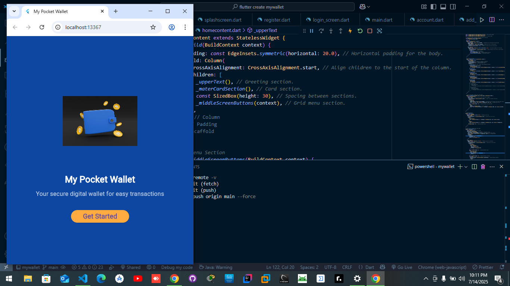

# 💳 MyWallet - Flutter Personal Finance App

MyWallet is a modern and intuitive personal finance management mobile application built with Flutter. It helps users manage their finances by offering features like adding bank accounts, topping up mobile money, and tracking withdrawals and spending.

---

## 🚀 Features

- 🔐 **Firebase Authentication** – Sign up and log in securely
- 💼 **Manage Accounts** – Add and track different accounts
- 💳 **Add a Card** – Save virtual card details
- 📲 **Mobile Recharge** – Recharge mobile airtime/data
- 💸 **Withdraw Funds** – Easy withdrawal flow with UI feedback
- 📊 **Transactions Overview** – (Coming soon) Visual breakdown of user transactions
- 🛡️ **Secure Data** – Firebase-backed secure storage
- 🌐 **Cross-Platform Support** – Android, iOS, Web, macOS, Linux, and Windows

---

## 📸 Screenshots

### 🟣 Splash Screen


### 💳 Add Card


### 🔐 Login


---
## 🧠 Tech Stack

| Layer         | Technology                   |
|--------------|------------------------------|
| UI           | Flutter (Dart)               |
| Auth & DB    | Firebase (Auth, Firestore)   |
| State Mgmt   | setState / Provider (Planned)|
| Platform     | Android, iOS, Web, Desktop   |

---

## 🏁 Getting Started

### Prerequisites

- [Flutter SDK](https://docs.flutter.dev/get-started/install)
- Firebase CLI (`npm install -g firebase-tools`)
- Dart (included with Flutter)
- Git

### Installation

1. **Clone the repository**
   ```bash
   git clone https://github.com/JuniorCarti/flutter-create-mywallet.git
   cd flutter-create-mywallet
````

2. **Install dependencies**

   ```bash
   flutter pub get
   ```

3. **Configure Firebase**

   * Replace the following files with your own Firebase config:

     * `android/app/google-services.json`
     * `ios/Runner/GoogleService-Info.plist`
   * Run:

     ```bash
     flutterfire configure
     ```

4. **Run the app**

   ```bash
   flutter run
   ```

---

## 📂 Project Structure

```
lib/
├── main.dart                  # App entry point
├── firebase_options.dart      # Firebase initialization
├── screens/
│   ├── splashscreen.dart
│   └── pages/
│       ├── register.dart
│       ├── login_screen.dart
│       ├── add_acard.dart
│       └── ...
├── classes/
│   └── homecontent.dart
assets/
├── images/
```

---

## 🧪 To-Do / Coming Soon

* [ ] Dark Mode
* [ ] Monthly Expense Summary
* [ ] Notification System
* [ ] Budget Goal Tracking
* [ ] Integration with Payment APIs

---

## 🤝 Contributing

Pull requests are welcome! If you’d like to improve something, feel free to fork and submit a PR.

1. Fork the repo
2. Create your feature branch: `git checkout -b feature/new-thing`
3. Commit your changes: `git commit -am 'feat: add new thing'`
4. Push to the branch: `git push origin feature/new-thing`
5. Open a Pull Request

---

## 📄 License

This project is open source and available under the [MIT License](LICENSE).

---

## 🔗 Contact

* GitHub: [@JuniorCarti](https://github.com/JuniorCarti)
* Email: *ridgejunior204@gmail.com*

---

> Made with ❤️ using Flutter
